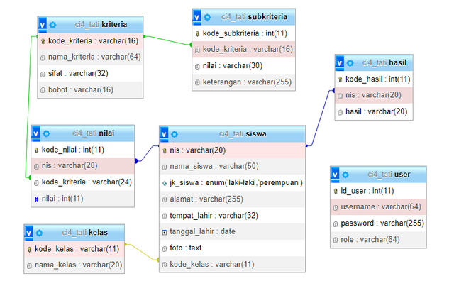
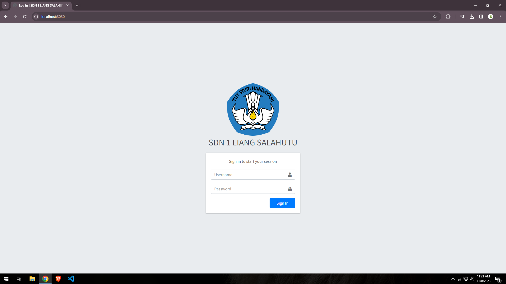
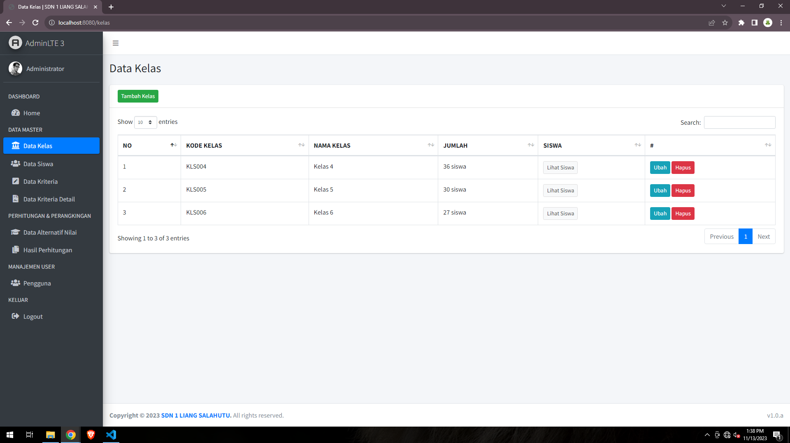
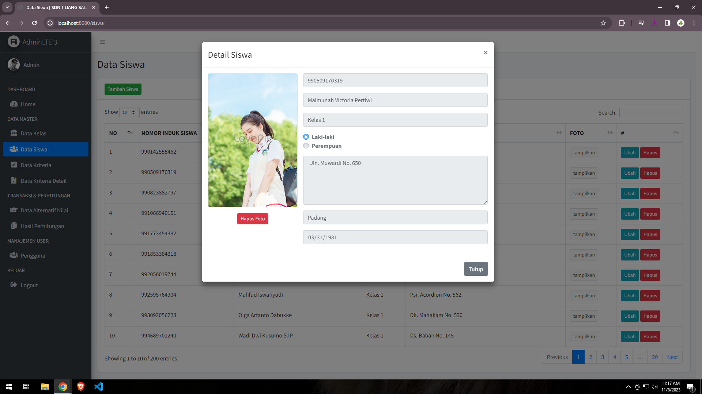
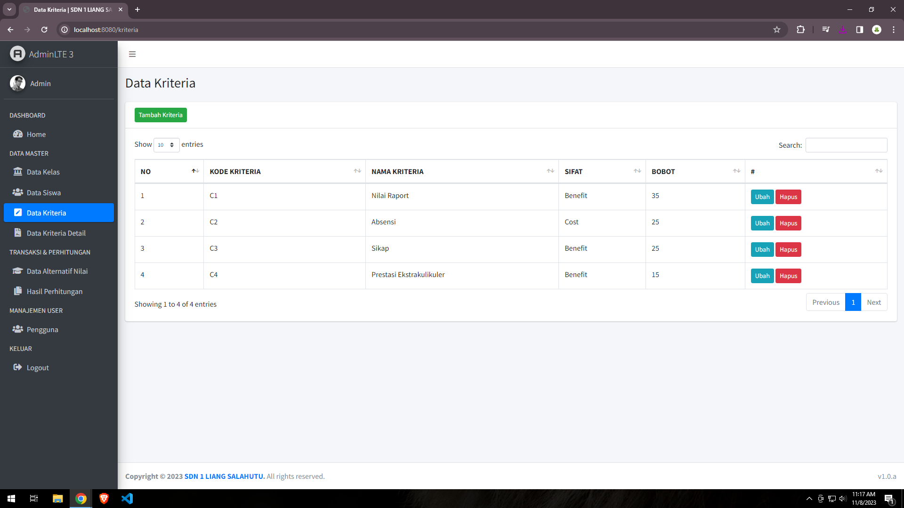
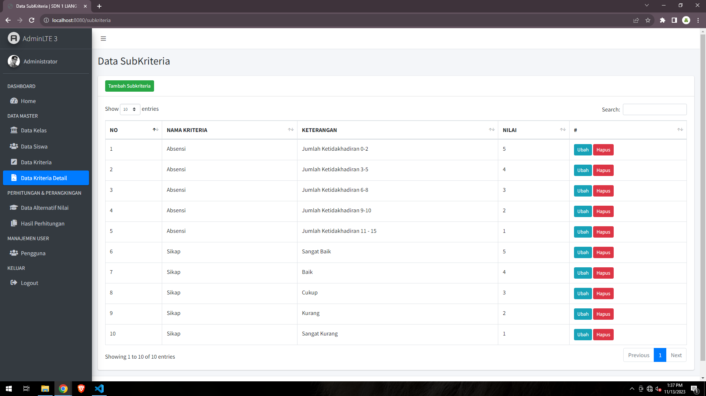
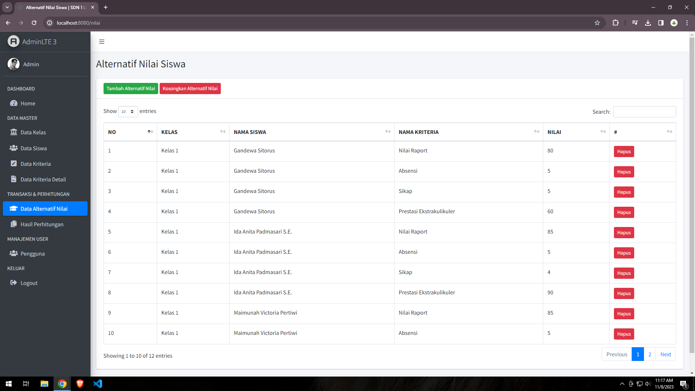
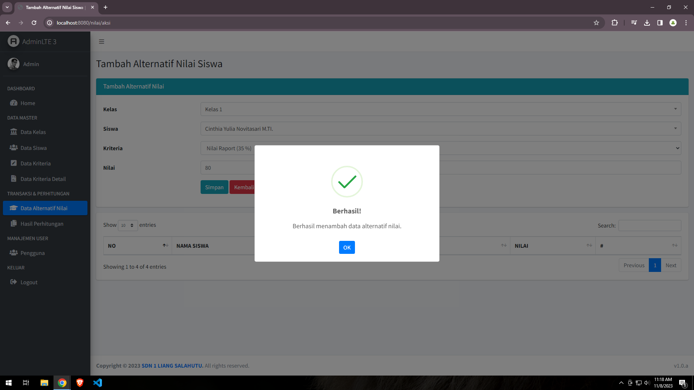
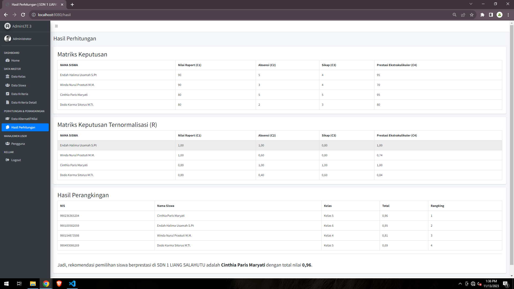

# Aplikasi Sistem Pendukung Keputusan Pemilihan Siswa Berprestasi di SD Negri 1 Liang

### Minimal Kebutuhan
- php ^7.4
- webserver
- database mysql

### Instalasi
- download Repo ini
- pindahkan ke folder htdocs
- buat database lalu import database.sql
- sesuaikan pengaturan database di file ./configuration.php
- jalankan di browser

### Template & Library
- AdminLTE
- Bootstrap
- jquery

### Struktur Table & Relasi
- 

### User & Password
- Role Administrator
  - Username: `admin`
  - Password: `admin`
- Role Kepala Sekolah
  - Username: `kepalasekolah`
  - Password: `kepalasekolah`

### Alur Sistem
- Pertama isi data master terlebih dahulu
  - Master Data Kelas, berelasi dengan halaman Master Data Siswa.
  - Master Data Siswa, berelasi dengan halaman Transaksi Data Alternatif Nilai
  - Master Data Kriteria, berelasi dengan halaman Transaksi Data Alternatif Nilai & Subkriteria
  - Master Data SubKriteria, Jika kamu menambahkan nilai Kriteria disini, maka di halaman Transaksi akan muncul menu select option, bukan input text. 
- Data Alternatif Nilai
  - Cara Menambahkan Data
    - Klik Tambah Alternatif Nilai
    - Pilih Kelas (Pada Select siswa akan muncul siswa sesuai dengan kelas yang dipilih)
    - Pilih Siswa (Halaman Tabel akan muncul data alternatif nilai siswa tersebut dan Select Kriteria akan muncul *Hanya* kriteria yang **belum ada**)
    - Pilih Kriteria (Akan muncul text/select box untuk mengisi nilai)
    - Isi nilai, lalu simpan.
- Hasil Perhitungan 
  - Sistem akan secara otomatis menghitung data yang sudah diisi pada Alternatif nilai tadi, jika ada kriteria yang kosong/belum terisi maka akan di*default*kan menjadi 0.

## Srenshoot
- 
- 
- 
- 
- 
- 
- 
- 

## Perubahan
#### 10 Nov 2023
- Ruang lingkup hanya pada siswa kelas 4,5 dan 6.
- Judul menu dari semula 'TRANSAKSI & PERHITUNGAN' menjadi 'PERHITUNGAN & PERANGKINGAN'.
- Hasil perangkingan yang semula hanya kolom rangking, nama siswa dan total mejadi nis, nama siswa, kelas, total dan rangking.
- Sub kriteria yang semula untuk jumlah kehadiran > 10 menjadi jumlah kehadiran 11 - 15.

#### 10 Des 2023
- Masukkan nilai asli dari absensi dan sikap di modul nilai
- Membuat edit di modul nilai
- Menambah tabel nilai asli di modul hasil
- Memperbaiki perhitungan untuk absensi
- Menghapus kalimat kesimpulan di modul hasil

